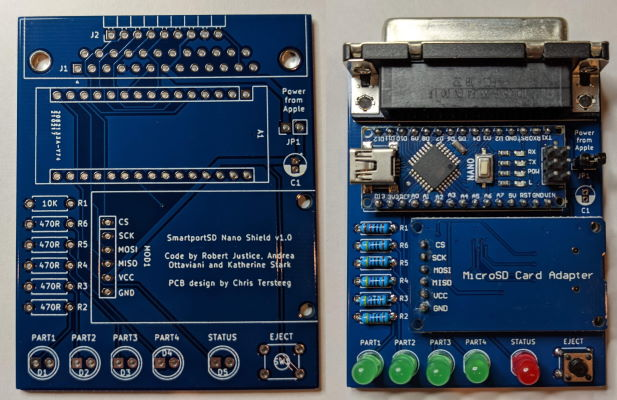

# smartport-nano-shield

This is a custom PCB to run the SmartportSD FAT code from Katherine Stark (based on the work of Robert Justice and Andrea Ottaviani) allowing you to connect a 32MB ProDOS partition to your SmartPort enabled Apple II (IIc, IIc+, IIgs).  Yes, it works with Total Replay.

Katherine's original repo is at https://gitlab.com/nyankat/smartportsd

I have a fork at https://gitlab.com/tersteeg/smartportsd that adds support for the four LED's in this design that show you the currently active partition.

All components can be sourced from the usual low cost China based vendors for a total build cost of around $10.  Please see the assembly page for more details.

[Hardware Component Choices and Assembly](https://djtersteegc.github.io/smartportsd-nano-shield/assembly.html)

An interactive BOM and parts placement diagram is also available.

[Interactive Bill of Materials (BOM)](https://djtersteegc.github.io/smartportsd-nano-shield/ibom.html)

If you wish to power your board from the 5V SmartPort line, simply install and close jumper JP1.  Be warned there is no protection on the board from back feeding voltage into the Apple host computer if you also power the Arduino via the USB connector, so only close this jumper when not using another power source on the Arduino.

# Getting a Board

If I have extra PCB's, they will be listed on Tindie (soon...).

Otherwise you can download the Gerbers and use your favorite fab (JLCPCB, PCBWay, etc.) to make your own batch.  It's a standard two layer, 1oz copper board with dimensions of 70mm x 56mm.

# Hardware Revisions

### Version 1.0

Tested and working.

# Acknowledgments

Robert Justice for his original SmartPortCFA project http://www.users.on.net/~rjustice/SmartportCFA/SmartportCFA.htm

Andrea Ottaviani for his Arduino/SD port of Robert's work http://www.users.on.net/~rjustice/SmartportCFA/SmartportSD.htm

Katherine Stark for adding FAT support to Andrea's work to make it easier to manage the partitions on the SD card.

