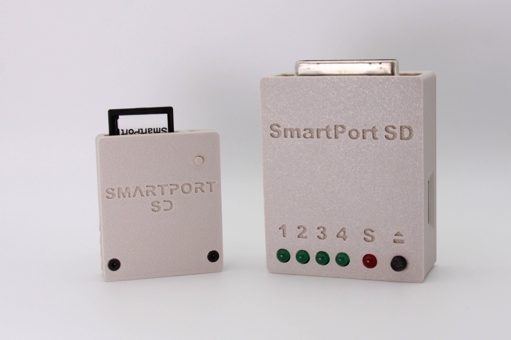
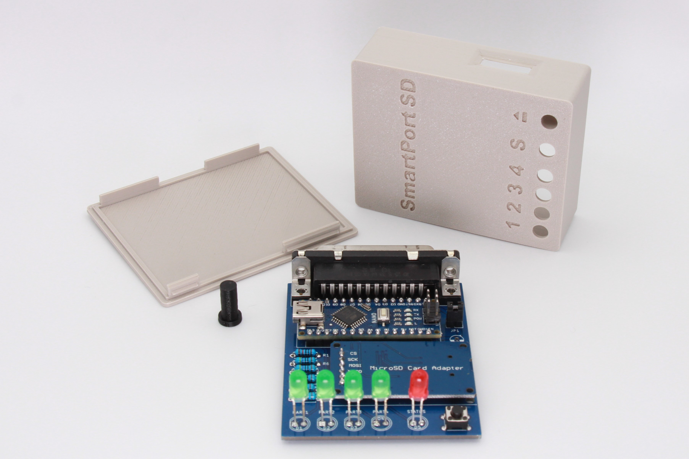
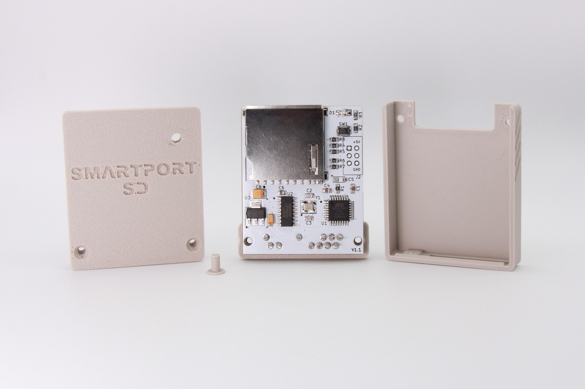
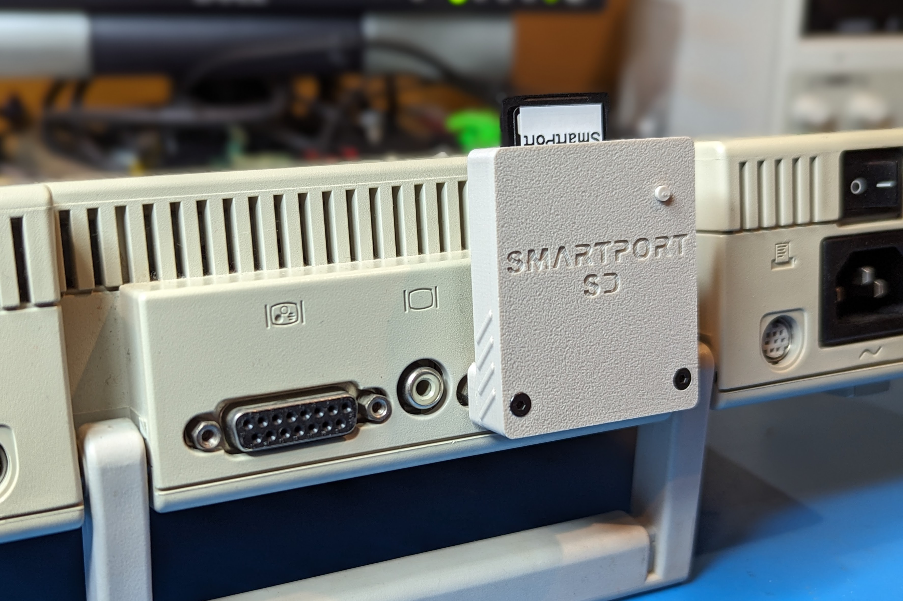
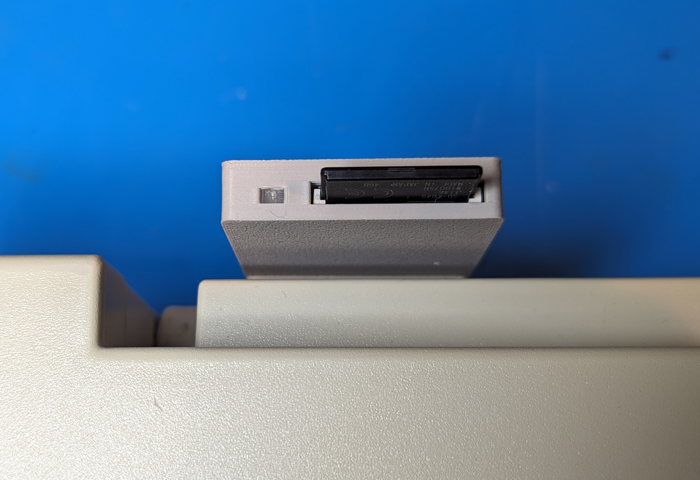
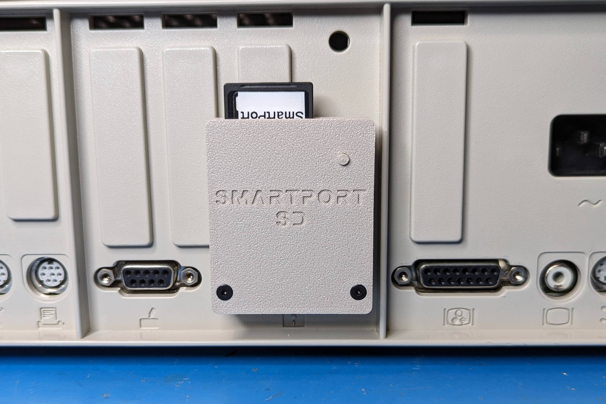
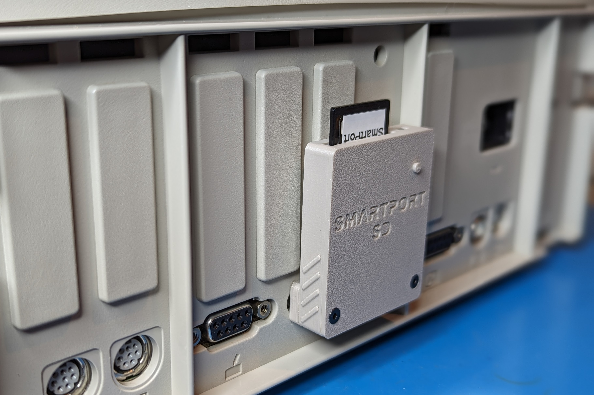

A couple PCB's I've designed to run the SmartportSD FAT code from Katherine Stark (based on the work of Robert Justice and Andrea Ottaviani) allowing you to connect a 32MB ProDOS partition to your SmartPort enabled Apple II (IIc, IIc+, IIgs). If you have a Apple IIe, solutions like a SoftSP card with you Disk II card, or something like Brad Bell's [SmartDiskII](https://github.com/btb/SmartDiskII) card will also allow hookup and usage. Yes, it works with Total Replay.

# SmartportSD Nano Shield

This is my original design.  Works best with a Duo Disk cable, but has a header to wire up a custom cable if needed.  All through hold modules, super easy build. I added some additional LED's to indicate which of the four ProDOS partitions is currently loaded.

See the [Nano Shield page](smartport-nano-shield/README.md) for BOM and assembly instructions.

# SmartportSD SMD

This one is a bit more of an advanced build and is based of my [Tapecart SD](https://github.com/djtersteegc/tapecart-sd-vertical) design I did for the Commodore 64. Uses a full size SD card for ease of handling and plugs in directly to the back of an Apple IIc/c+/gs.  There is a lightpipe for the activity LED and the narrow case design allows plenty of clearance for the bulkiest composite video connectors I could find in my collection.

See the [SMD page](smartport-smd/README.md) for BOM and assembly instructions.

# Getting a Board

If I have extra PCB's, they will be listed on Tindie.

https://www.tindie.com/products/tersteeg/smartportsd-apple-ii-pcb/

Otherwise you can download the gerbers and use your favorite fab (JLCPCB, PCBWay, etc.) to make your own batch.

# Acknowledgements

Robert Justice for his original SmartPortCFA project http://www.users.on.net/~rjustice/SmartportCFA/SmartportCFA.htm

Andrea Ottaviani for his Arduino/SD port of Robert's work http://www.users.on.net/~rjustice/SmartportCFA/SmartportSD.htm

Katherine Stark for adding FAT support to Andrea's work to make it easier to manage the partitions on the SD card. https://gitlab.com/nyankat/smartportsd

