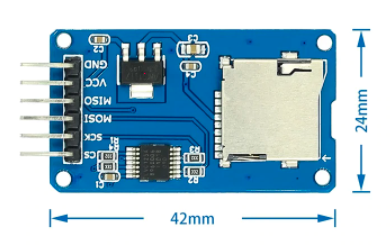

# Hardware Component Choices and Assembly

[Interactive Bill of Materials (BOM)](ibom.html)

### Connecting to your Apple II

You have two options here.  If you are lucky enough to have a DB19 to DB25 DuoDisk Drive cable, you can simply solder on a female DB25 jack and you're good to go.

Or you can wire up your own cable using the 2.54mm 9p header J2.  The pinout is as follows:

| SmartPort | DB19 pin | J2 pin |
| --------- | -------- | ------ |
| RDDATA    | 18       | 1      |
| PH0       | 11       | 2      |
| PH1       | 12       | 3      |
| PH2       | 13       | 4      |
| PH3       | 14       | 5      |
| WRDATA    | 19       | 6      |
| +5V       | 6        | 7      |
| GND       | 1        | 8      |
| WRPROT    | 10       | 9      |

### Arduino Nano v3.0

I've have good luck with the ~$2 Chinese clones, but I would suggest flashing it first before soldering to the board.  Sometimes you do get a bad unit, or a unit that hasn't been flashed with the boot loader and requires you flash it yourself via the ICSP headers.

Make sure it's a 16Mhz ATMEGA328P board running at 5V.

### Micro SD Card Connector

This is the common push-push [Micro SD module](https://www.aliexpress.com/item/1873549637.html) with level shifters.  Sometimes it may say "Catalex" (maybe the original designer?) on the back of the PCB.  You will need to remove the pre-soldered right angle header they all seem to come with so you can mount it upside down on the shield board.

### Bulk Capacitor

C1 is a bulk storage capacitor for the 5V rail.  It is optional since the Arduino already has caps on-board, but if you have a marginal SmartPort 5V line or experience other power issues, they could help stabilize the overall board.  Any value between 10uf to 47uf is fine.

### Resistors

Either 1/4W or 1/8W can be used in all locations.

R1 is the pull-down resistor for the eject button.  Anything from 1K to 10K is probably fine here.

R2 through R6 controls the activity and active partition LED brightness. A good calculator is at:

[http://ledcalc.com/](http://ledcalc.com/)

if you want to use something other the 470 ohm spec on the board.  Just don't exceed 20ma.

 

