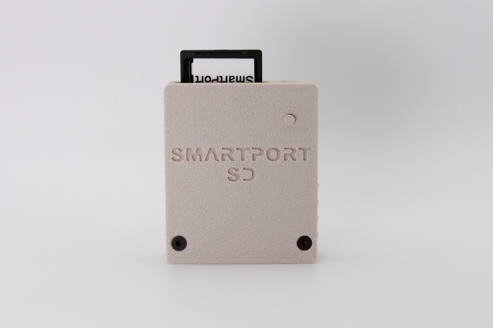
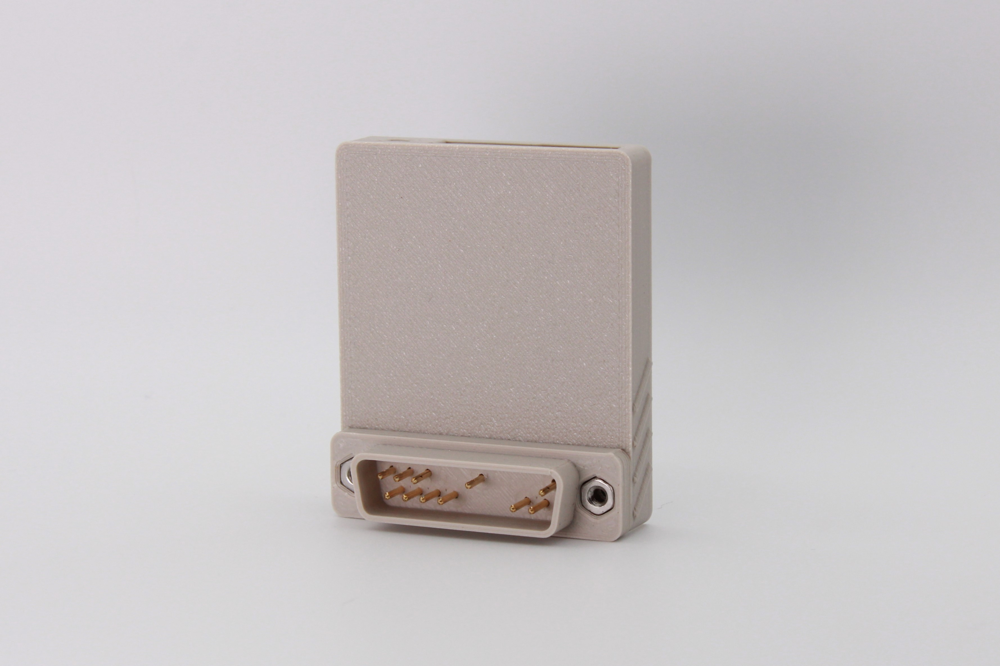
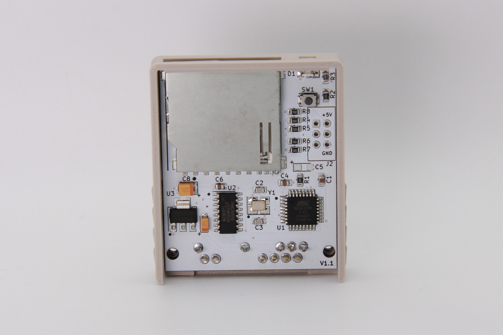
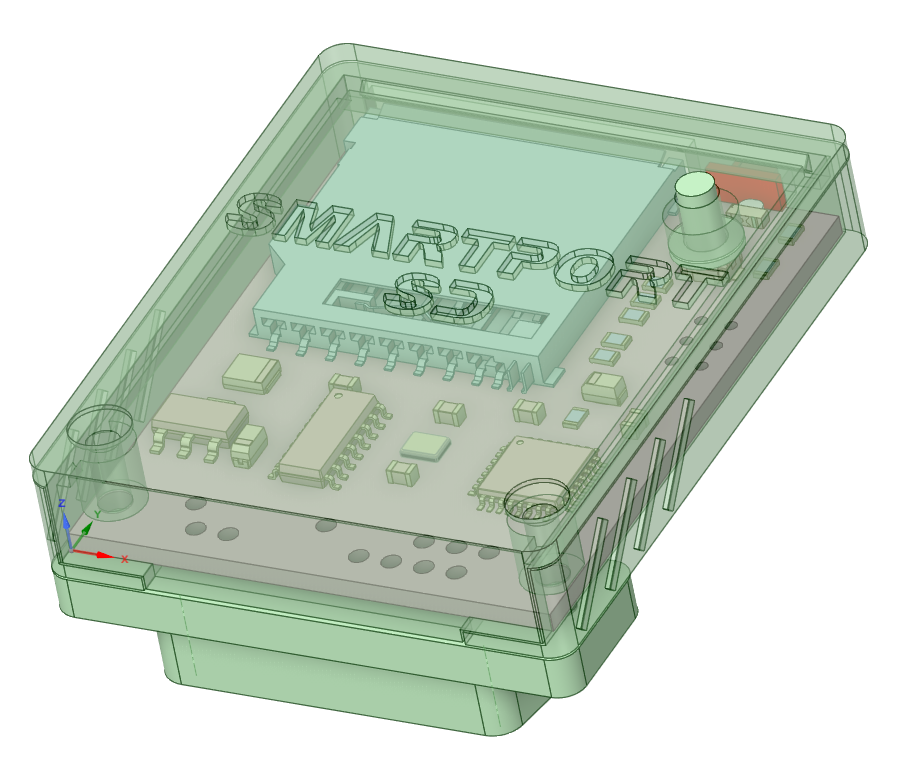
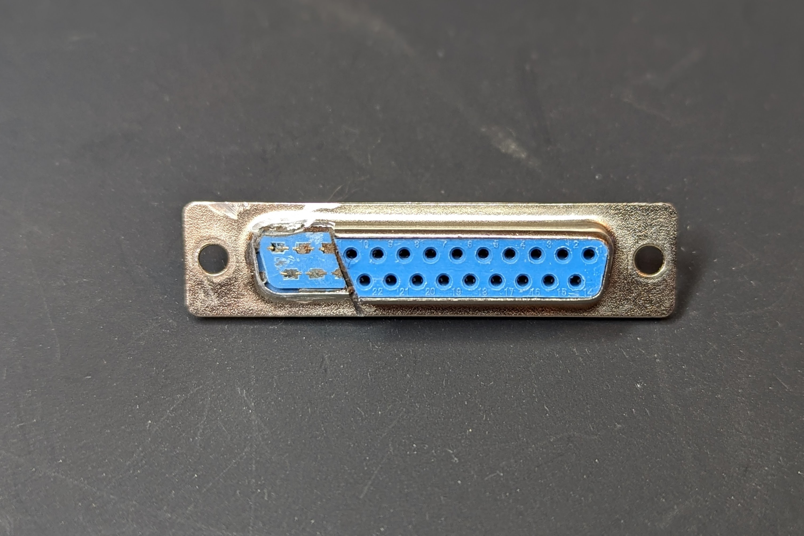
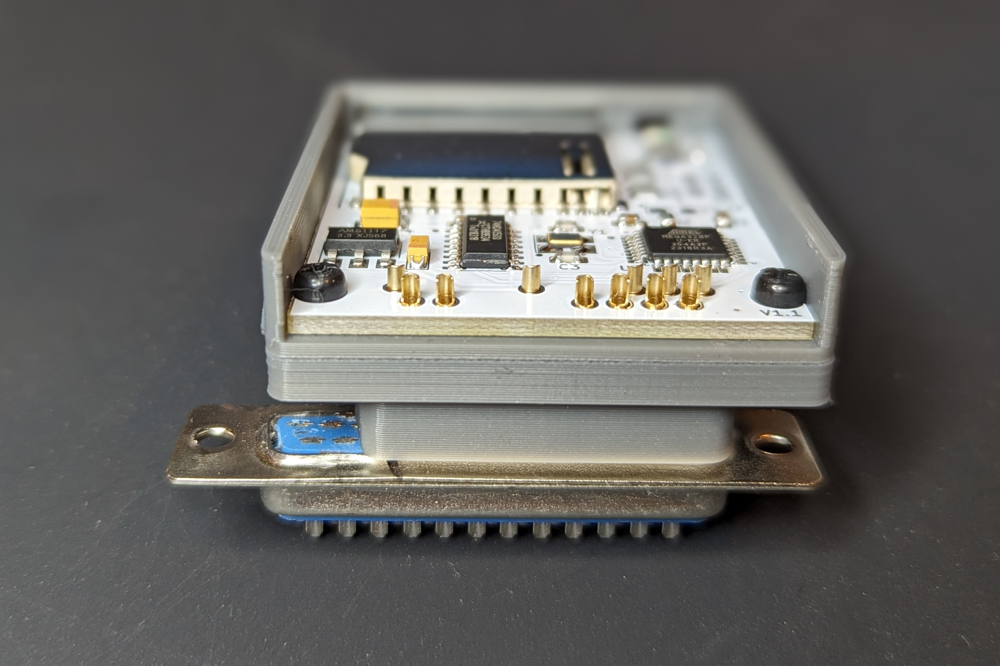
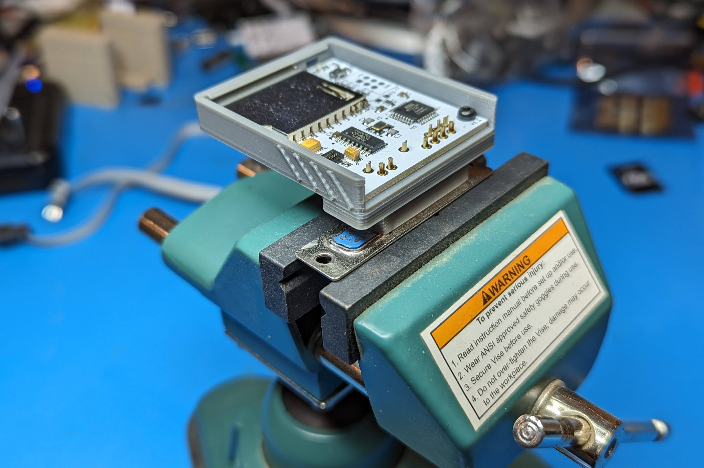
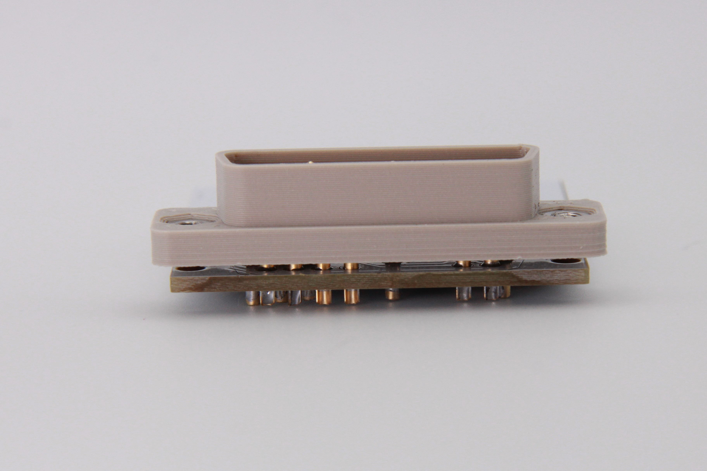
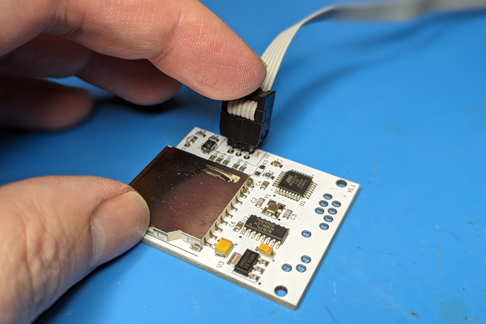
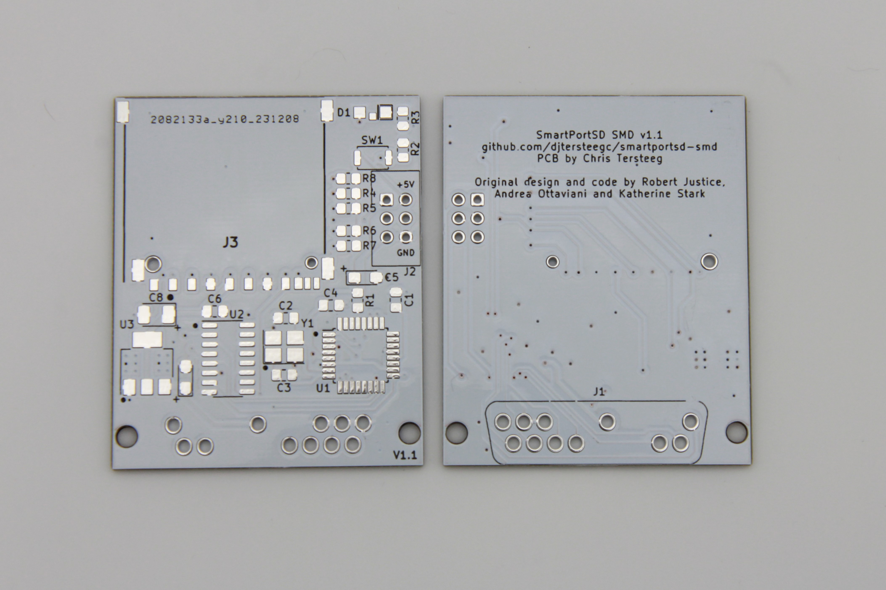

# BOM

There's an interactive BOM [here](https://djtersteegc.github.io/smartportsd/ibom-smd-v1.1.html), and CSV version with footprint info [here](https://djtersteegc.github.io/smartportsd/bom-smd-v1.1.csv). The interactive one is super useful when placing the SMD components.

C5 is an optional bulk capacitor for the 5V power rail near the MCU.  In my experience building these it is not needed.

The SD card connector is commonly available from several different Chinese suppliers and often called "long body", "non popping", or "push pull" on AliExpress or eBay.

https://www.aliexpress.us/item/3256805779248826.html

Here's some links on LCSC.

https://www.lcsc.com/product-detail/SD-Card-Connectors_Hanbo-Electronic-SD-112_C961673.html

https://www.lcsc.com/product-detail/SD-Card-Connectors_XUNPU-SD-102_C266602.html

https://www.lcsc.com/product-detail/SD-Card-Connectors_Megastar-ZX-SD-282-8Y_C7419835.html

It should also cross with a Wurth 693063010911 or AMP GSD090012SEU if you want something domestically.

The pins for the DB19 connector can be purchased from this seller on AliExpress,  https://www.aliexpress.us/item/3256802431271655.html Ideally I would have used the "PCB Plug" model if they stocked them which are similar to the TE/AMP 5-745287-4 model mozzwald used on the [FujiApple DB19 to IDC20 adapters](https://github.com/FujiNetWIFI/fujinet-hardware/tree/master/AppleII/DB-19M-Adapter), but these are much more cost effective and work just as well once assembled.

# Case

The case was created in DesignSpark and the design file is available if you would like to modify it further.

There is a single light pipe that should be printed in transparent material, or you can just leave it off completely. The case is designed to be printed at 0.2mm layer heights and assembled with two M2.5x14mm screws through the connector body and two M2.5 nuts pushed into either the handle or lid.

# Assembly

Assemble all the SMD components.  I use solder paste hand applied with pneumaticdispenser and then finish on a hot plate.  But you can also hand solder, use hot air, or even order a stencil for paste application and use a proper reflow oven. I use a red LED for the activity indicator. Make sure to observe polarity with the green stripe on the LED to the right matching the white stripe on the PCB silkscreen.

Do NOT install the 2x3 ICSP pin header at J2.  I would recommend flashing the firmware at this point to do basic checks since it's easier to do board rework before you install the DB19 pins.

To install the connector, first take your print DB19 shell and use a 1.0mm and 2.0mm drill bit to properly size the holes.  I use a cut down DB25 connector to hold the pins straight while soldering, it also makes a nice way to hold everything in a vise while you solder.

Insert the pins and case shell through the case back and assemble with short M2.5 screws.  Tighten the screws gently so you can still slide out the case in the future if needed and then solder the pins.

When complete it should look something like this when slide out the case.

Press the light pipe into the LED opening with the lip side facing up and then slide the board in. If you can't slide the PCB under the light pipes, they are installed upside down.  The side mounted LED's should keep the light pipes from falling out, even if they aren't a tight friction fit in the openings.

# Firmware Flashing

The ATmega328P is the same used an Arduino Uno/Nano/Micro, but lacks the necessary bootloader firmware and serial interfaces to flash via the Arduino IDE or programs like XLoader. You could program the chip before installing it with something like a [TL866/T48](TL866/T48) and a [TQFP32 to DIP 32 adapter](https://www.aliexpress.us/item/2251832227450089.html), but I prefer to just use a cheap [UBSASP](https://www.aliexpress.us/item/2251832600419163.html) and [avrdude](https://github.com/avrdudes/avrdude). Make sure you get a 10 pin to 8 pin adapter with the USBASP if it isn't natively an 8 pin model.

Since you didn't solder the 2x3 pin header on the ICSP port J2, you will need to hold the header pins at an angle in the holes to make contact while you run avrdude.  If you're feeling fancy, you could spring for a [2x3 double row 2.54mm test clip](https://www.aliexpress.us/item/3256805646654844.html) or [handheld pogo pin probe](https://www.aliexpress.us/item/3256805545980544.html).  The cheap angle method works fine for me.

Since this model doesn't have the extra LED's to show the active partition, the firmware used is Katherine's standard version from https://gitlab.com/nyankat/smartportsd.  

In my [firmware](firmware) directory there are couple of Windows scripts and a precompiled version of the SmartportSD firmware.

First you to need to setup your ATMega328p with the correct fuse setting so it uses the external 16 MHz crystal, same as an Arduino board. **burn-328p-fuses.cmd** executes the following:

`avrdude -c usbasp -p m328p -B 125kHz -U lfuse:w:0xFF:m -U hfuse:w:0xDE:m -U efuse:w:0x05:m`

Next flash SmartportSD-1.15.ino.with_bootloader.standard.hex with **flash-smartportsd.cmd** that executes:

`avrdude -c usbasp -p m328p -u -U flash:w:SmartportSD-1.15.ino.with_bootloader.standard.hex`

Plug into your Apple II and enjoy! 

# Getting a Board

If you are in the US, PCB's are available from my Tindie store, https://www.tindie.com/products/tersteeg/smartportsd-apple-ii-pcb/

Otherwise, you can grab the [gerbers](gerbers) and order from your favorite PCB fab.

# PCB Revisions

### Version 1.0

Worked but since it was pertty much a 1:1 copy of my TapecartSD base PCB, was just a little to wide to clear the composite video connector on an Apple IIc once cased.

### Versions 1.1 (Current)

Board was narrowed to allow needed clearance on IIc/c+ models.