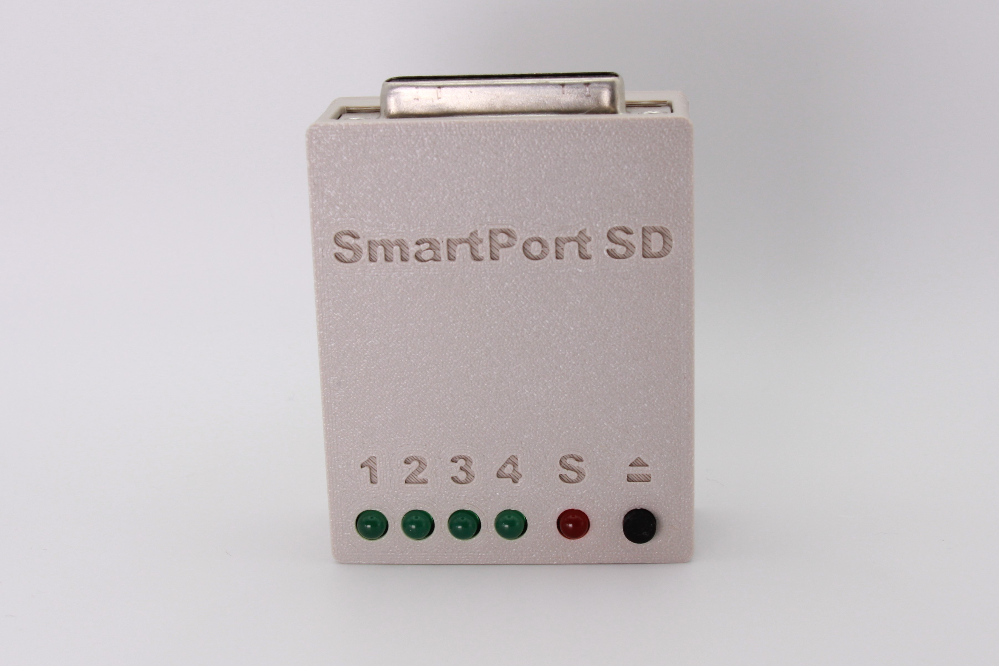
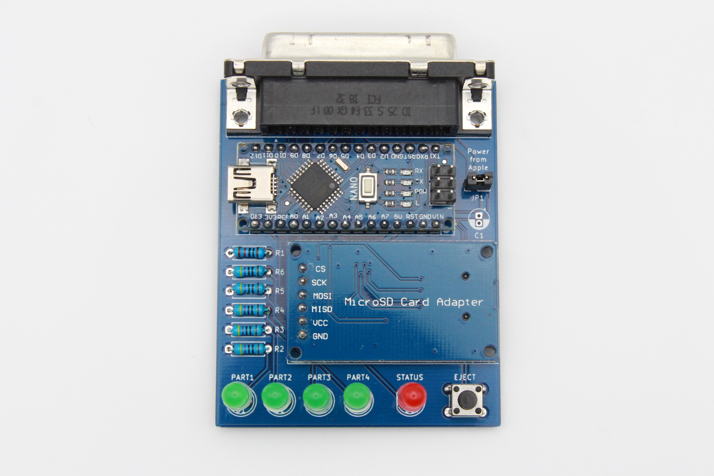
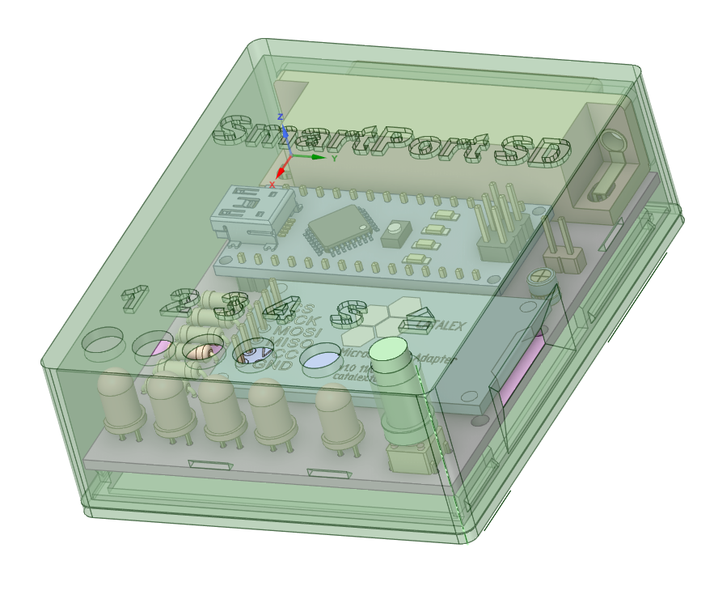
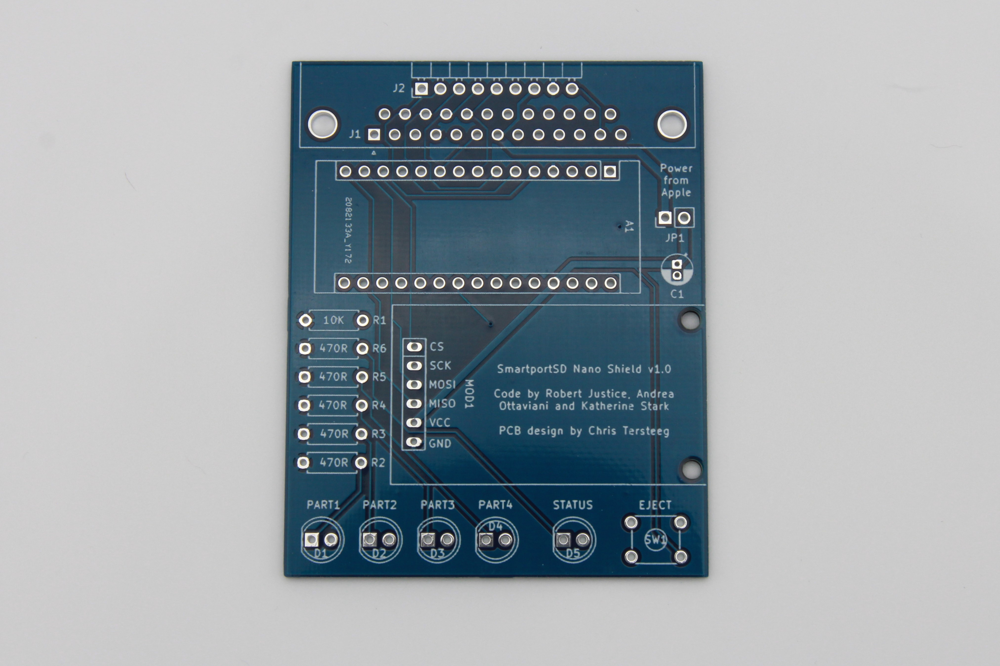

# BOM

All components can be sourced from the usual low-cost China based vendors for a total build cost of around $10. An interactive BOM and parts placement diagram is available.

[Interactive Bill of Materials (BOM)](https://djtersteegc.github.io/smartportsd/ibom-nano-shield-v1.0.html)

### Arduino Nano v3.0

I've had good luck with the ~$2 Chinese clones, but I would suggest flashing it first before soldering to the board.  Sometimes you do get a bad unit, or a unit that hasn't been flashed with the boot loader and requires you flash it yourself via the ICSP headers.

Make sure it's a 16Mhz ATMEGA328P board running at 5V.

### Micro SD Card Connector

This is the common push-push [Micro SD module](https://www.aliexpress.com/item/1873549637.html) with level shifters.  Sometimes it may say "Catalex" (maybe the original designer?) on the back of the PCB.  You will need to remove the pre-soldered right-angle header they all seem to come with so you can mount it upside down on the shield board.

### Bulk Capacitor

C1 is a bulk storage capacitor for the 5V rail.  It is optional since the Arduino already has caps on-board, but if you have a marginal SmartPort 5V line or experience other power issues, they could help stabilize the overall board.  Any value between 10uf to 47uf is fine.

### Resistors

Either 1/4W or 1/8W can be used in all locations.

R1 is the pull-down resistor for the eject button.  Anything from 10K to 47K is probably fine here.

R2 through R6 controls the activity and active partition LED brightness. A good calculator is at:

[http://ledcalc.com/](http://ledcalc.com/)

if you want to use something other the 470 ohm spec on the board.  Just don't exceed 20ma.

# Case

STL's and the [DesignSpark Mechanical](https://www.rs-online.com/designspark/mechanical-software) source file for an simple snap fit enclosure are in the **enclosure** directory. Clearances are intentionally a bit tight so nothing rattles, but it prints well on a standard Ender 3 type printer without any post processing needed.

# Assembly

If you plan on casing the PCB, print the case out first before the install the LED's you can space them properly.  I use about 2.4mm of reveal with standard 5mm LED's so they are just poking above the surface of the case face.

# Firmware Flashing

Katherine's original repo is at https://gitlab.com/nyankat/smartportsd

I have a fork at https://gitlab.com/tersteeg/smartportsd that adds support for the four LED's in this design that show you the currently active partition.

# Connecting to your Apple II

You have two options here.  If you are lucky enough to have a DB19 to DB25 DuoDisk Drive cable, you can simply solder on a female DB25 jack and you're good to go.

Or you can wire up your own cable using the 2.54mm 9p header J2.  The pinout is as follows:

| SmartPort | DB19 pin | J2 pin |
| --------- | -------- | ------ |
| RDDATA    | 18       | 1      |
| PH0       | 11       | 2      |
| PH1       | 12       | 3      |
| PH2       | 13       | 4      |
| PH3       | 14       | 5      |
| WRDATA    | 19       | 6      |
| +5V       | 6        | 7      |
| GND       | 1        | 8      |
| WRPROT    | 10       | 9      |

# Usage

If you wish to power your board from the 5V SmartPort line, simply install and close jumper JP1.  Be warned there is no protection on the board from back feeding voltage into the Apple host computer if you also power the Arduino via the USB connector, so only close this jumper when not using another power source on the Arduino.

# Getting a Board

If I have extra PCB's, they will be listed on Tindie.

https://www.tindie.com/products/tersteeg/smartportsd-apple-ii-pcb/

Otherwise you can download the Gerbers and use your favorite fab (JLCPCB, PCBWay, etc.) to make your own batch.  It's a standard two layer, 1oz copper board with dimensions of 70mm x 56mm.

# Hardware Revisions

### Version 1.0

Tested and working.

